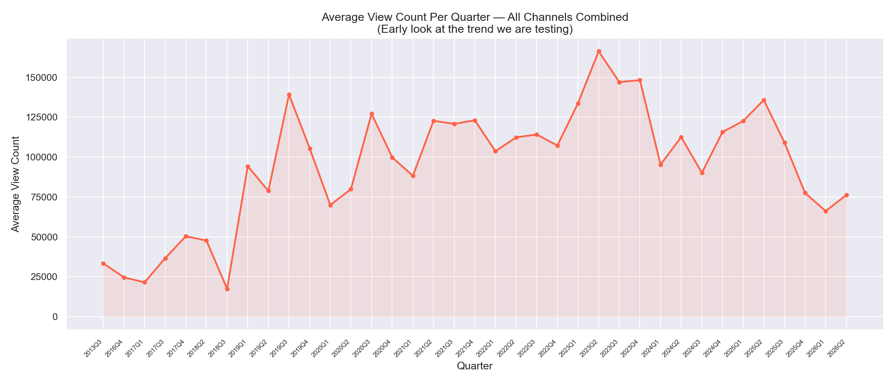
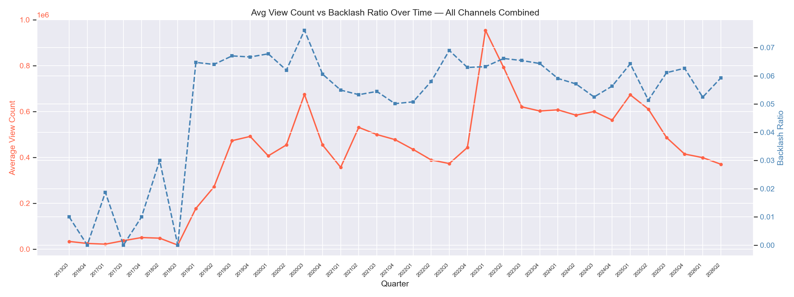
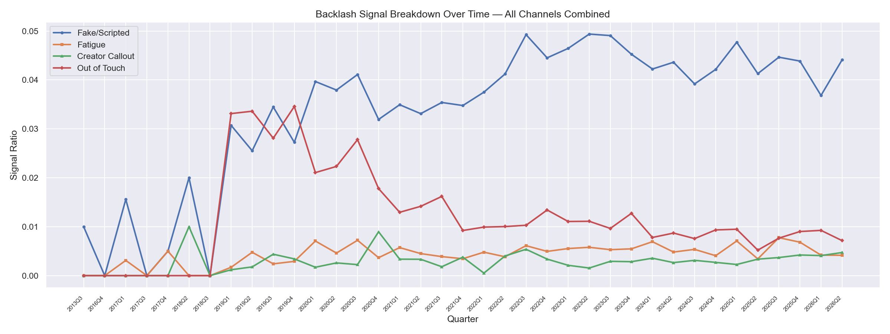
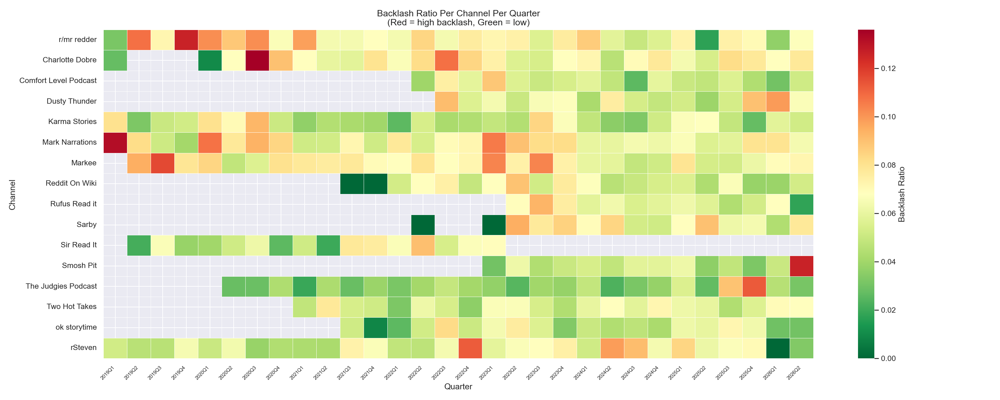
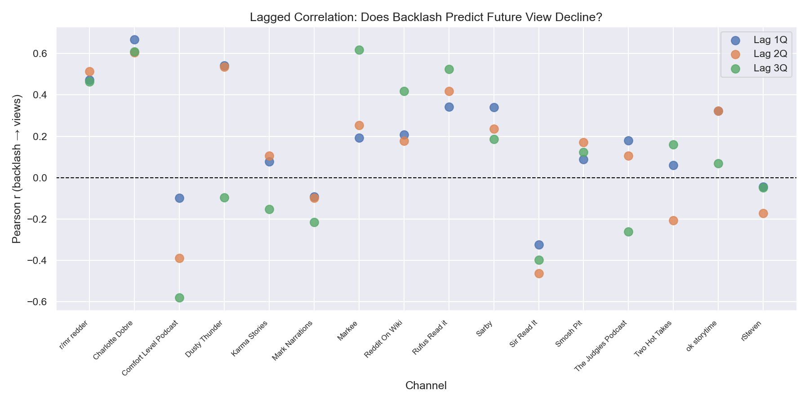
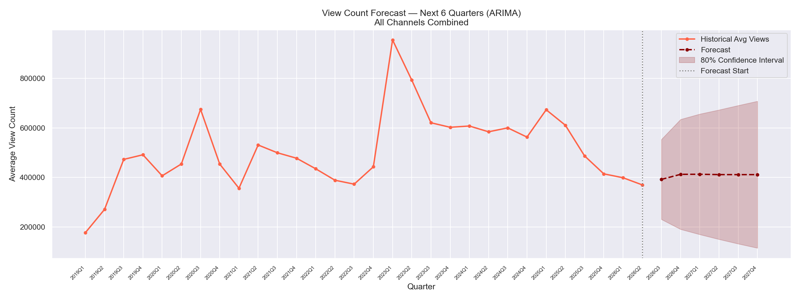

# 📉 Reddit Storytime YouTube Trend Analysis

> A data analytics project examining the rise, saturation, and decline of Reddit storytime content on YouTube — using the YouTube Data API, NLP sentiment analysis, and time-series forecasting.

**Built by:** [Saumya Joshi]  
**Role:** Product Manager  
**Status:** ✅ Complete

---

## 🧠 Project Overview

Reddit storytime channels — where creators read r/AmITheAsshole, r/AmIOverreacting, and similar posts — became one of YouTube's fastest-growing content formats between 2020 and 2022. But since 2023, a visible pattern emerged: audiences calling out creators for fake stories, AI-generated voices, and chasing views over authenticity.

**This project asks: Can we measure and predict that decline using real data?**

### Key Findings
- Average views per video peaked at ~950,000 in 2023Q1 and fell 61% to ~370,000 by 2026Q2
- The format is stabilizing, not dying — ARIMA forecast projects ~400K views through 2027
- Fake/Scripted is the dominant and growing backlash signal, overtaking Out of Touch after 2020
- Backlash predicts view decline for smaller channels but not larger ones — controversy drives clicks for established creators
- Upload volume does not prevent decline — channels posting 400 videos/quarter declined at the same rate as low-frequency channels

---

## 🗺 Project Roadmap

| Phase | Description | Status |
|-------|-------------|--------|
| 1 | Research & Hypothesis Definition | ✅ Done |
| 2 | Environment Setup & API Access | ✅ Done |
| 3 | Data Collection — Videos & Comments | ✅ Done |
| 4 | Sentiment Analysis (NLP) | ✅ Done |
| 5 | Trend Modeling & Forecasting | ✅ Done |
| 6 | Documentation & GitHub Publishing | ✅ Done |

---

## 📊 Key Charts

### Average Views Over Time


### Views vs Backlash Ratio


### Backlash Signal Breakdown


### Backlash Heatmap Per Channel


### Lagged Correlation Analysis


### View Count Forecast


---

## 🔧 Tech Stack

| Tool | Purpose |
|------|---------|
| Python 3.14 | Core language |
| YouTube Data API v3 | Data source |
| pandas | Data manipulation |
| nltk | NLP / text processing |
| matplotlib / seaborn | Visualization |
| statsmodels | Time-series forecasting (ARIMA) |
| scipy | Statistical correlation analysis |
| GitHub | Version control + portfolio |


## 📁 Project Structure
`````
reddit-storytime-analysis/
│
├── data/
│   ├── channels.csv          # Channel metadata
│   ├── videos.csv            # 33,515 videos
│   ├── comments.csv          # 140,240 comments
│   ├── sentiment_scores.csv  # Backlash ratios per channel per quarter
│   ├── merged_data.csv       # Views + sentiment combined
│   └── correlation_results.csv
│
├── scripts/
│   ├── fetch_channels.py
│   ├── fetch_videos.py
│   ├── fetch_comments.py
│   ├── sentiment_analysis.py
│   ├── exploratory_analysis.py
│   ├── trend_analysis.py
│   └── forecast.py
│
├── docs/
│   ├── hypothesis.md
│   └── findings.md
│
├── outputs/
│   └── charts/               # 11 charts
│
├── .env                      # Environment variables
├── .gitignore
├── requirements.txt
└── README.md

````

## ⚠️ Limitations & Honest Caveats

- YouTube API returns top comments only — not a random sample
- Keyword matching misses sarcasm and nuance
- View counts captured at a single point in time
- Some channels have limited data points making individual forecasts unreliable
- Forecast confidence intervals are wide — treat projections as directional

---

## 🚀 Getting Started

```bash
git clone https://github.com/yourusername/yt-trend-analysis.git
cd yt-trend-analysis
pip3 install -r requirements.txt
cp .env.example .env  # Add your YouTube API key
python3 fetch_channels.py
```


*Built by [Saumya Joshi] — Product Manager*