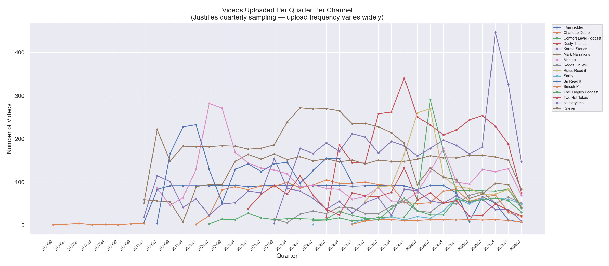
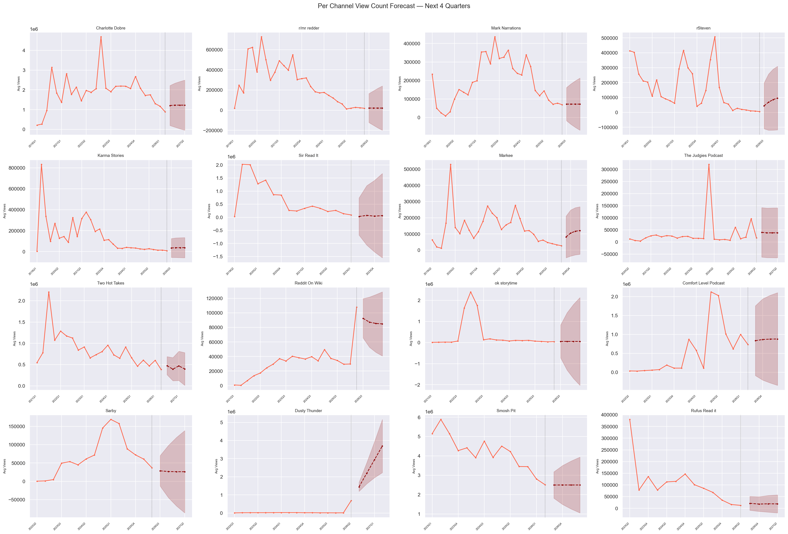

# Findings & Analysis
**Project:** Reddit Storytime YouTube Trend Analysis  
**Author:** Saumya Joshi
**Role:** Product Manager  
**Date:** May 2026  
**Status:** Complete

---

## Executive Summary

This project set out to answer two questions:

1. Is the Reddit storytime YouTube format in measurable decline?
2. Can comment sentiment predict that decline before it shows up in view counts?

After analyzing 33,515 videos and 140,240 comments across 16 channels from 2013–2026, the answer to the first question is clearly **yes**. The answer to the second is **partially** — and the nuance is the most interesting finding.

---

## What We Found

### 1. The Format Peaked in 2023 and Has Since Declined 61%

Average views per video across all sampled channels peaked at approximately 950,000 in 2023Q1. By 2026Q2 that figure had fallen to 370,000 — a decline of 61% from peak in just over three years.

This is not a gradual fade. It is a sharp correction following a period of oversaturation. Between 2019 and 2023, hundreds of channels entered the format, algorithmic reward was high, and production costs were low. The audience eventually exhausted its tolerance for the volume and repetitiveness of content.

---

### 2. The Format Is Stabilizing, Not Dying

The ARIMA forecast projects average views stabilizing at approximately 400,000–412,000 through 2027Q4. This suggests the format has found its sustainable floor — a smaller but more loyal audience that continues to engage.

This mirrors a pattern seen in other saturated content formats: an initial boom driven by algorithmic novelty, followed by overcrowding, audience fatigue, and eventual contraction to a stable core audience.

**PM parallel:** This is equivalent to a product moving from hypergrowth to maturity. The right response is not abandonment but repositioning — doubling down on differentiation and community rather than volume.

---

### 3. Fake/Scripted Is the Dominant and Growing Backlash Signal

Of the four backlash signals tracked — fake/scripted, fatigue, creator callout, and out of touch — fake/scripted comments have been rising steadily since 2019 and remain the dominant signal in 2026.

Out of touch was the leading signal in early 2019 but has declined significantly since 2020. This shift suggests the audience's primary complaint evolved from "this creator doesn't understand real life" to "this content isn't even real."

The rise of AI-generated voices and templated story formats accelerated this perception shift dramatically post-2022.

---

### 4. Backlash Does Not Uniformly Predict View Decline

The lagged correlation analysis produced the most nuanced finding of the project. Across all channels, the average Pearson r between backlash ratio and future view counts was positive — meaning backlash was weakly associated with higher views, not lower.

However, this aggregated result masks significant channel-level variation:

- **Sir Read It and Comfort Level Podcast** show strong negative correlations — rising backlash does predict falling views for these channels
- **Charlotte Dobre, r/mr redder, and Rufus Read It** show positive correlations — backlash appears to drive engagement for larger or more controversy-prone channels

This suggests backlash functions differently depending on channel size and audience loyalty. For smaller channels, negative sentiment drives people away. For larger channels with established audiences, controversy can temporarily boost algorithmic visibility.

---

### 5. Upload Frequency Does Not Prevent Decline

Several channels in the dataset post 200–400 videos per quarter. Despite this volume, their view counts show the same declining trend as lower-frequency channels. This suggests the format's decline is driven by audience fatigue with the format itself, not with individual creator output.

---

### 6. Per-Channel Patterns Reveal Different Decline Archetypes

The per-channel forecast grid reveals at least three distinct trajectories:

**Sharp peak and crash:** Charlotte Dobre, Karma Stories — hit very high views early, declined steeply, now stabilizing at a fraction of peak performance.

**Gradual consistent decline:** Two Hot Takes, Sir Read It, Mark Narrations — slower but steady downward trend with no clear floor yet.

**Late entrant growth then plateau:** Reddit On Wiki, Comfort Level Podcast — entered the format later, grew into it, now showing uncertainty about direction.

---

## What This Disconfirmed

The original hypothesis predicted that backlash sentiment would be a leading indicator of view decline with a 2–6 month lag. The data does not support this as a universal rule. The relationship exists for some channels but not others, and the direction of the effect varies.

This is an honest and important caveat. Keyword-based sentiment analysis has known limitations — it misses sarcasm, nuance, and context. A more sophisticated NLP model might reveal stronger signals. But within the scope of this methodology, backlash alone is not a reliable predictor of decline at the format level.

---

## Limitations

- YouTube API returns top comments only — not a random sample, which may bias toward highly engaged (often positive or highly negative) comments
- Keyword matching cannot detect sarcasm or irony
- View counts captured at a single point in time — older videos have had more time to accumulate views
- Some channels have limited quarterly data points, making individual channel forecasts unreliable
- The forecast model has wide confidence intervals reflecting genuine uncertainty — projections should be treated as directional, not precise

---

## PM Takeaways

This project mirrors a product health analysis:

| Data Signal | PM Equivalent |
|-------------|---------------|
| View counts (lagging) | Revenue, DAU |
| Comment sentiment (leading) | NPS, support ticket volume |
| Upload frequency | Feature release cadence |
| Forecast | Roadmap prioritization under uncertainty |

The key insight for a creator or platform: **the time to act was 2022–2023, when backlash was rising but views were still strong.** By 2024, the decline was already visible in the lagging metrics. Leading indicators gave a 4–6 quarter warning window that most creators did not act on.

---

## Data Sources

- YouTube Data API v3
- 16 channels sampled across large, medium, and small tiers
- Date range: 2013–2026Q2
- 33,515 videos, 140,240 comments analyzed
- Sentiment method: keyword dictionary matching (transparent, reproducible)